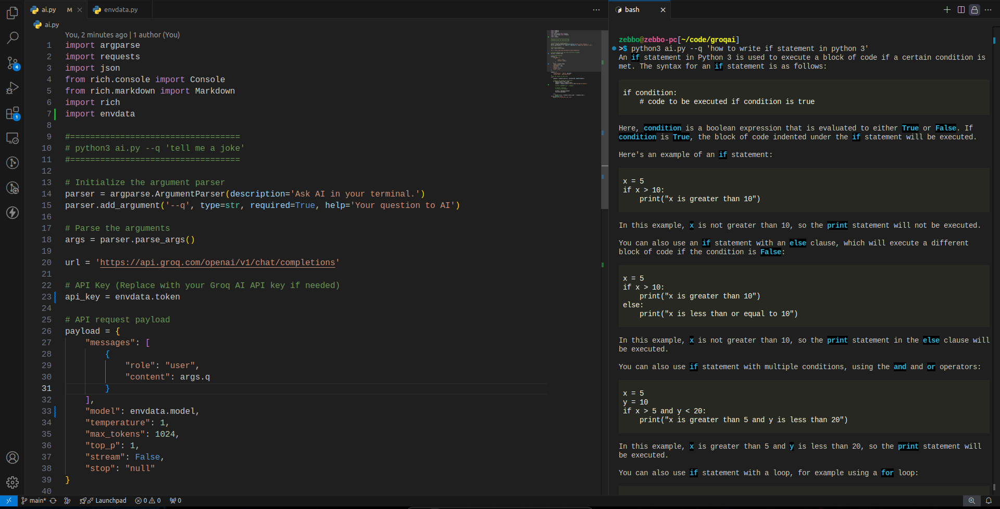

**Terminal AI**
================

A simple command-line application that lets you ask AI questions and receive answers directly in your terminal.

Terminal AI in vscode bash.

**Getting Started**
-------------------
### Requirements

1. Python 3.10
2. Terminal

### Installation

1. Clone this repository:
   ```
   git clone https://github.com/zahiruddinnorzain/terminal-ai.git
   ```
2. Change into the project directory:
   ```
   cd terminal-ai
   ```
3. Install the required dependencies:
   ```
   pip install -r requirements.txt
   ```
4. Register and get API token from groq.com

5. Copy envdata.example.py then paste and rename to envdata.py
   ```
   cp envdata.example.py envdata.py
   ```
6. Paste your token in file envdata.py
   ```
   token = 'token_here'
   ```

7. Start the application:
   ```
   python ai.py --q 'hi there'
   ```

### Using the Application

1. Once the application is running, you can start asking AI questions by typing them in the terminal. For example:
   ```
   python ai.py --q 'What is the meaning of biotechnology?'
   ```
2. The AI will respond with an answer, which will be displayed directly in the terminal.

**Features**

* Ask AI questions using natural language syntax
* Receive answers in a human-readable format
* Powered by Groqai, Llama.

**Notes**

* This application requires a stable internet connection to function properly
* The AI engine used may not always provide accurate or relevant responses
* Report any issues or suggestions to this [github](https://github.com/zahiruddinnorzain/terminal-ai.git)

I hope this helps! Let me know if you have any questions or need further assistance.

**License**
The Terminal-ai is open-sourced software licensed under the [MIT license](https://opensource.org/licenses/MIT).

**Credit**
zahiruddinnorzain

**Screenshot**
Terminal AI in vscode bash.
